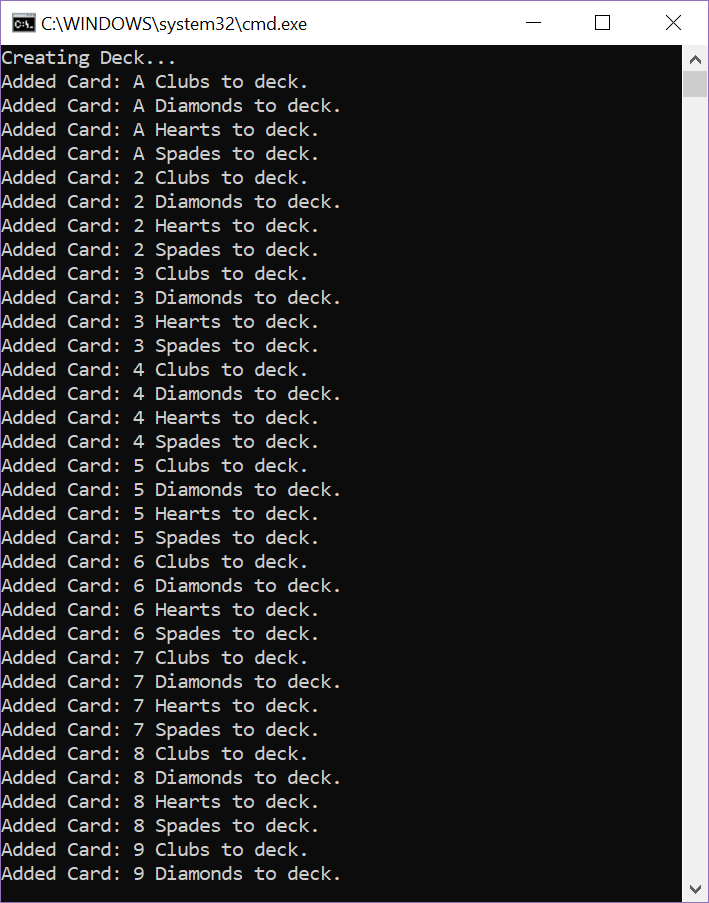
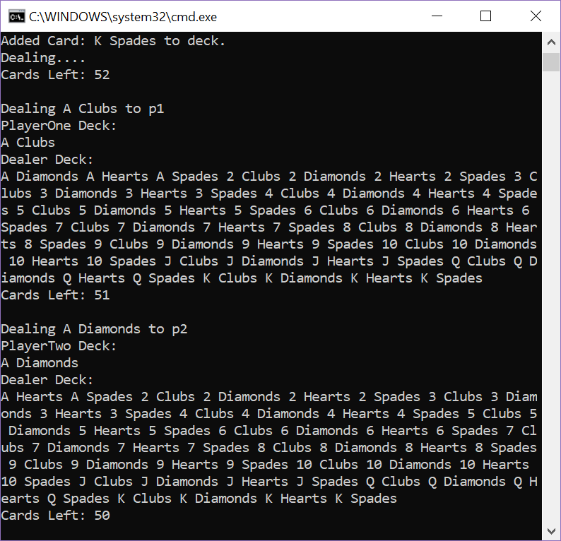

# Lab07-Collections

## Description
This program instantiates a new Deck of Cards and deals those cards to two player. If there are any cards left over, the dealer keeps them.
It constains a generic Container Deck, and a custom class of Cards, as well as basic functions to manipulate the Deck and Cards, including Add and Deal.

## Instructions
Open up the console and watch it deal cards! It will do this automatically.  
 
### Create Your Own Deck
- Open up the program.cs.
- Instatiate a the dealer's Deck of cards
```
Deck<Card> newDealerDeck = new Deck<Card>
```
- Fill your new deck with cards. You can do this with a for loop, or by hand.
```
Card firstCard = new Card("Ace", Card.Suit.Diamonds)
newDealerDeck.Add(firstCard)
```
- Instatiate two more Decks
- Pass those decks into the Deal Method and run the program.
```
Deal(newDealerDeck, deckOne, deckTwo);
```

## Sample Output
### Creating Deck

### Dealing Demo


